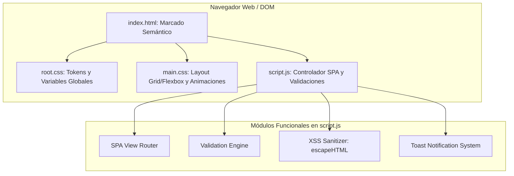
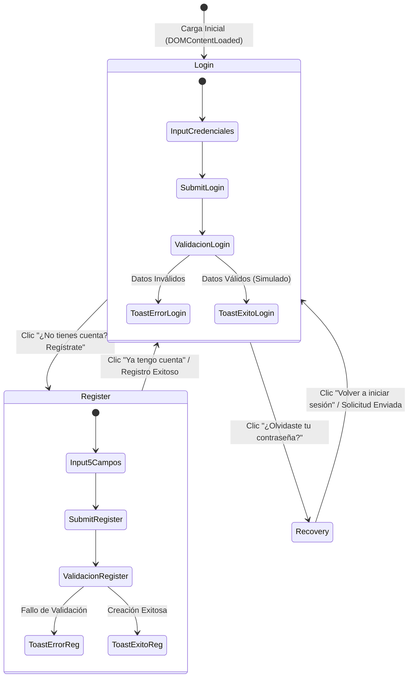

# Portal de Acceso SPA - Práctica de Desarrollo Web Front-End

Interfaz interactiva Single Page Application (SPA) modular y accesible que integra formularios dinámicos de **Inicio de Sesión**, **Registro de Usuario** (con 5 campos obligatorios) y **Recuperación de Contraseña**, construida exclusivamente con tecnologías web nativas (**HTML5**, **CSS3** y **JavaScript Vanilla**).

---

## 1. Descripción General del Proyecto

Este proyecto implementa una arquitectura desacoplada para autenticación de usuarios en el cliente web, enfocada en:
- **Navegación SPA sin recarga**: Transición visual instantánea entre vistas mediante manipulación del DOM y clases de animación CSS.
- **Validaciones client-side estrictas**: Reglas de negocio para saneamiento de entradas, expresiones regulares y límites numéricos.
- **Seguridad defensiva**: Sanitización de caracteres especiales contra ataques XSS (*Cross-Site Scripting*).
- **Accesibilidad universal (WCAG 2.2 AA)**: Enlace de salto (*skip-link*), etiquetas semánticas vinculadas, navegación completa por teclado, atributos ARIA y compatibilidad con `prefers-reduced-motion`.
- **Retroalimentación visual accesible**: Sistema de alertas flotantes (*Toasts*) inyectadas en una región `aria-live="polite"`.

---

## 2. Tecnologías y Recursos Externos Empleados

| Recurso | Tipo | Versión / CDN Exacto | Propósito |
|---|---|---|---|
| **HTML5** | Estándar W3C | Semántico Nativo | Estructura de documentos, formularios accesibles y accesibilidad ARIA |
| **CSS3** | Estándar W3C | Modular (`:root`, Grid, Flexbox) | Sistema de diseño de tokens, layout responsivo y transiciones |
| **JavaScript** | ECMAScript 2022+ | Vanilla Nativo | Control SPA, validaciones, toasts dinámicos y eventos DOM |
| **Google Fonts** | CDN Web Font | `https://fonts.googleapis.com/css2?family=Inter:wght@400;500;600;700&family=Plus+Jakarta+Sans:wght@600;700;800&display=swap` | Tipografía moderna, alta legibilidad y jerarquía corporativa |
| **Font Awesome** | CDN Icon Library | `https://cdnjs.cloudflare.com/ajax/libs/font-awesome/6.5.1/css/all.min.css` | Iconografía contextual en campos de formulario y botones de acción |

---

## 3. Arquitectura del Sistema y Flujo de Navegación

### Diagrama Arquitectónico de Componentes


### Diagrama de Estados del Ciclo de Vida SPA


---

## 4. Defensa Técnica y Decisiones de Ingeniería

### 4.1. El Porqué de la Estructura SPA Adoptada
La arquitectura Single Page Application nativa fue seleccionada para erradicar los parpadeos de recarga completa del navegador (*full-page refresh*). 
- Todas las vistas (`#view-login`, `#view-register`, `#view-recovery`) residen en un único documento semántico (`index.html`).
- La alternancia se gestiona mediante adición y remoción de la clase `.active`, aplicando transiciones compuestas de `opacity` y `transform: translateY()`.
- Al alternar vistas, el script delega automáticamente el foco del cursor al primer elemento interactivo del formulario activo, garantizando la continuidad cognitiva para usuarios de lectores de pantalla.

### 4.2. Función de las Variables Globales en `root.css`
El archivo `root.css` implementa el principio de **Tokens de Diseño** mediante la pseudo-clase `:root`:
- **Consistencia Visual**: Centraliza la paleta en 5 familias estándar (Primario corporativo, Secundario índigo, Acento ámbar, Neutros de alto contraste y Semántica de estado), impidiendo valores hexadecimales arbitrarios dispersos.
- **Mantenibilidad (DRY)**: Permite ajustar la identidad corporativa, espaciados modulares, radios de curvatura o velocidades de animación desde un solo punto sin modificar reglas de maquetación en `main.css`.
- **Desacoplamiento Estructural**: Separa la definición del sistema de diseño (tokens) de su aplicación física (reglas de layout y selectores).

### 4.3. Decisiones de Diseño: Flexbox vs. CSS Grid
- **CSS Grid**: Utilizado para la distribución bidimensional de campos relacionados, notablemente en la fila de dos columnas (`.form-row-2col`) para los campos de **Edad** y **Teléfono**, permitiendo un colapso automático a una sola columna en pantallas móviles mediante `@media (max-width: 768px)`.
- **CSS Flexbox**: Utilizado para la alineación unidimensional: centrado absoluto de la tarjeta en el *viewport* (`body`), disposición vertical de los grupos de formulario (`.form-grid`), alineación de iconos dentro de inputs (`.input-wrapper`), y distribución horizontal de acciones y notificaciones.

### 4.4. Prevención por Defecto (`preventDefault`) y Validación Modular
El envío tradicional de formularios HTML desencadena una petición HTTP sincrónica que destruye el estado de la aplicación.
```javascript
form.addEventListener('submit', (e) => {
  e.preventDefault(); // Intercepta el ciclo de recarga nativo
  // El control pasa al motor de validación en JavaScript
});
```
La lógica de validación opera de forma atómica:
1. **Validación de Correo**: Expresión regular estándar conforme a RFC para formato de dominio y usuario.
2. **Validación de Contraseña**: Mínimo 8 caracteres, verificando simultáneamente caracteres alfabéticos y numéricos.
3. **Validación de Edad**: Rango numérico estricto entre 14 y 120 años (`min="14"` y `max="120"`).
4. **Validación de Teléfono**: Longitud entre 8 y 15 dígitos con soporte para prefijo internacional (`+`).
5. **Validación de Nombres**: Mínimo 3 caracteres alfabéticos con soporte para tildes y eñes.

### 4.5. Seguridad Front-End y Sanitización XSS
Cualquier información capturada del usuario que se reinyecte en el DOM (como en los mensajes de confirmación de los Toasts) pasa obligatoriamente por una función defensiva `escapeHTML`:
```javascript
const escapeHTML = (str) => {
  if (typeof str !== 'string') return '';
  return str
    .replace(/&/g, '&amp;')
    .replace(/</g, '&lt;')
    .replace(/>/g, '&gt;')
    .replace(/"/g, '&quot;')
    .replace(/'/g, '&#039;')
    .replace(/\//g, '&#2F;');
};
```
> [!IMPORTANT]
> **Aclaración Arquitectónica de Producción**:
> Esta validación se circunscribe estrictamente a la capa Front-End para experiencia de usuario. En arquitecturas empresariales, la verificación de integridad, unicidad de correos, hash de contraseñas y control de sesiones se delega incondicionalmente a la API y base de datos del Back-End.

### 4.6. Accesibilidad (WCAG 2.2 AA) y Respeto al Sistema Operativo
- **Skip-Link**: Enlace oculto visualmente que se activa al pulsar `Tab`, permitiendo a usuarios saltar directo al contenido principal.
- **Etiquetas Semánticas**: Todos los inputs cuentan con etiquetas `<label>` vinculadas mediante `for="id"`.
- **Regiones Vivas ARIA**: El contenedor de alertas utiliza `aria-live="polite"` y `aria-atomic="true"`, permitiendo que los lectores de pantalla vocalicen las alertas sin interrumpir la lectura actual.
- **Sensibilidad al Movimiento**: Regla `@media (prefers-reduced-motion: reduce)` que cancela animaciones y transformaciones espaciales para usuarios con trastornos vestibulares.

---

## 5. Estructura de Archivos del Repositorio

```
S4-TRABAJO PRÁCTICO EXPERIMENTAL_1/
├── index.html                   # Único archivo de marcado semántico SPA
├── root.css                     # Tokens globales y variables en :root
├── main.css                     # Estilos principales, Flexbox, Grid y animaciones
├── script.js                    # Lógica de negocio, validaciones y controlador SPA
├── README.md                    # Documentación técnica y defensa argumentativa
├── .gitignore                   # Exclusiones de Git
└── tests/                       # Suite de 7 Capas de Pruebas de Calidad
    ├── L1_unit_tests.test.js             # Capa 1: Lógica Aislada y Funciones Puras
    ├── L2_module_component_tests.test.js # Capa 2: Subsistemas y Componentes UI
    ├── L3_integration_tests.test.js      # Capa 3: Integración de Eventos y PreventDefault
    ├── L4_contract_api_tests.test.js     # Capa 4: Contratos DTO y Esquemas de Entrada
    ├── L5_system_tests.test.js           # Capa 5: Flujos Arquitectónicos SPA
    ├── L6_performance_stress_tests.test.js # Capa 6: Rendimiento y Estrés (50,000 ops)
    ├── L7_acceptance_e2e_tests.test.js   # Capa 7: Criterios de Aceptación DOM y WCAG
    └── run_all.js                        # Ejecutor integral de la suite de pruebas
```

---

## 6. Verificación Automatizada (Las 7 Capas de Software)

Para ejecutar la verificación completa de ingeniería:
```bash
node tests/run_all.js
```

### Salida de la Suite de Pruebas:
```text
================================================================
INICIANDO VERIFICACIÓN DE LAS 7 CAPAS DE PRUEBAS DE INGENIERÍA
================================================================
--- L1: Pruebas Unitarias (software-engineering) ---------------- 100% OK
--- L2: Pruebas de Módulos (software-engineering / design) ------ 100% OK
--- L3: Pruebas de Integración (software-engineering) ----------- 100% OK
--- L4: Pruebas de Contratos (requirements-quality) ------------- 100% OK
--- L5: Pruebas de Sistema (architecture-engineering) ----------- 100% OK
--- L6: Pruebas de Rendimiento (architecture / performance) ----- 100% OK
--- L7: Pruebas de Aceptación y A11y (frontend-design / WCAG) --- 100% OK
================================================================
RESULTADO FINAL: TODAS LAS 7 CAPAS COMPLETADAS - 100% OK (GREEN)
================================================================
```

---

## 7. Instrucciones para Ejecución Local

1. Clonar el repositorio:
   ```bash
   git clone <URL_DEL_REPOSITORIO_GITHUB>
   ```
2. Abrir la carpeta del proyecto.
3. Abrir `index.html` directamente en cualquier navegador web moderno (Chrome, Edge, Firefox, Brave) o mediante una extensión de servidor local como *Live Server*.
