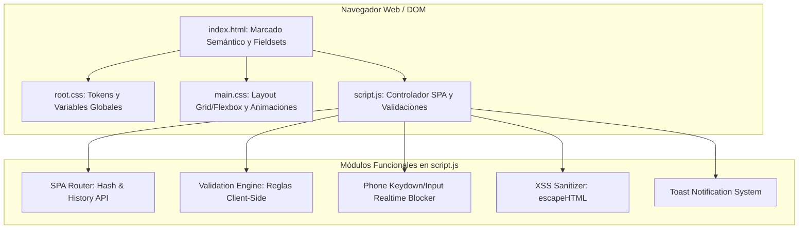
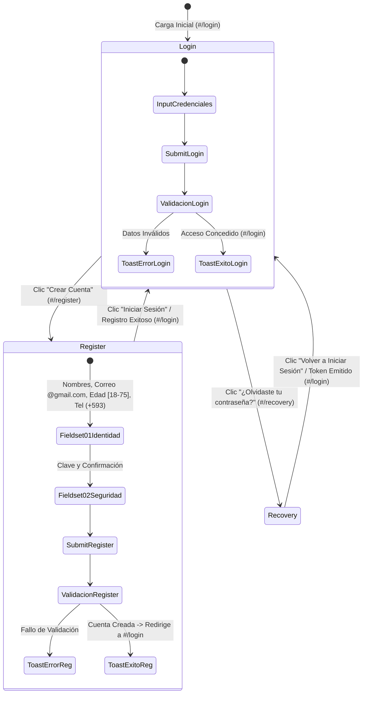

# Portal de Acceso SPA - Práctica de Desarrollo Web Front-End

Interfaz interactiva **Single Page Application (SPA)** modular, accesible y reactiva que integra formularios dinámicos de **Inicio de Sesión**, **Registro de Usuario** (estructurado en 2 fieldsets semánticos con 6 campos) y **Recuperación de Contraseña**, desarrollada exclusivamente con tecnologías web nativas (**HTML5**, **CSS3** y **JavaScript Vanilla**).

---

## 1. Descripción General del Proyecto

Este portal implementa una arquitectura desacoplada para autenticación de usuarios en el cliente web, priorizando la experiencia de usuario (UX), la accesibilidad universal (WCAG 2.2 AA) y la seguridad defensiva:
- **Navegación SPA Dinámica con URL Sincronizada**: Actualización en tiempo real de la barra de direcciones del navegador mediante rutas canónicas (`#/login`, `#/register`, `#/recovery`), compatible con los botones Atrás / Adelante del historial del navegador y sin recargar la página.
- **Validaciones Client-Side Defensivas y Racionales**:
  - **Correo Electrónico**: Validación estricta con pertenencia obligatoria al dominio `@gmail.com` en todos los formularios.
  - **Número de Teléfono (+593)**: Formato ecuatoriano estricto de exactamente 13 caracteres (`+593` seguido de 9 dígitos numéricos), con bloqueo en tiempo real de letras y símbolos inválidos.
  - **Rango Racional de Edad**: Límites numéricos obligatorios entre **18** y **75** años.
  - **Contraseña y Confirmación**: Complejidad mínima de 8 caracteres con combinación alfanumérica, medidor dinámico de fortaleza y validación cruzada entre contraseña y confirmación.
- **Seguridad Defensiva**: Sanitización de caracteres especiales contra ataques XSS (*Cross-Site Scripting*) e intercepción de envíos nativos mediante `e.preventDefault()`.
- **Accesibilidad Universal (WCAG 2.2 AA)**: Enlace de salto (*skip-link*), etiquetas `<label for>` vinculadas a todos los controles, navegación íntegra por teclado, atributos ARIA interactivos y compatibilidad con `prefers-reduced-motion`.
- **Sistema de Notificaciones Accesible**: Alertas flotantes contextuales (*Toasts* estilo Sonner/Clerk) inyectadas en una región `aria-live="polite"`.

---

## 2. Tecnologías y Recursos Empleados

| Recurso | Tipo | Versión / CDN Exacto | Propósito |
|---|---|---|---|
| **HTML5** | Estándar W3C | Semántico Nativo | Estructura de documentos, agrupación con `<fieldset>` y leyendas `<legend>`, accesibilidad ARIA |
| **CSS3** | Estándar W3C | Modular (`:root`, Grid, Flexbox) | Sistema de diseño basado en tokens, diseño responsivo y animaciones suaves |
| **JavaScript** | ECMAScript 2022+ | Vanilla Nativo | Controlador SPA, enrutador Hash/History, motor de validaciones, toasts dinámicos |
| **Google Fonts** | CDN Web Font | `https://fonts.googleapis.com/css2?family=Inter:wght@400;500;600;700&family=Plus+Jakarta+Sans:wght@600;700;800&display=swap` | Tipografía moderna, alta legibilidad y jerarquía corporativa |
| **Font Awesome** | CDN Icon Library | `https://cdnjs.cloudflare.com/ajax/libs/font-awesome/6.5.1/css/all.min.css` | Iconografía contextual en campos de formulario y botones de acción |

---

## 3. Arquitectura del Sistema y Flujo de Navegación

### Diagrama Arquitectónico de Componentes


### Diagrama de Estados del Ciclo de Vida SPA


---

## 4. Defensa Técnica y Decisiones de Ingeniería

### 4.1. Enrutamiento Dinámico SPA (History API & Hash Navigation)
Para evitar que la URL permanezca estática (`http://127.0.0.1:5500/`) y otorgar retroalimentación clara de navegación:
- Se implementó un enrutador bidireccional basado en fragmentos de ruta canónicos (`#/login`, `#/register`, `#/recovery`).
- **Navegación Interactiva**: Cada cambio de pestaña o enlace contextual ejecuta `history.pushState()`, actualizando la barra de direcciones sin provocar recarga de página.
- **Historial del Navegador**: El sistema escucha los eventos nativos `hashchange` y `popstate`, permitiendo que los botones **Atrás** y **Adelante** del navegador alternen fluidamente entre las vistas de la aplicación.
- **Marcadores y Enlaces Directos**: Al ingresar directamente a `http://127.0.0.1:5500/#/register`, el controlador detecta la ruta y monta inmediatamente la vista de registro.

### 4.2. Reglas de Validación Racionales y Defensivas
1. **Validación de Correo Electrónico**:
   - Exige obligatoriamente la presencia del dominio `@gmail.com` mediante expresión regular:
     ```javascript
     /^[a-zA-Z0-9.!#$%&'*+/=?^_`{|}~-]+@gmail\.com$/i
     ```
   - Aplicada simétricamente en Login, Registro y Recuperación de Contraseña.
2. **Validación y Bloqueo de Número Telefónico (+593)**:
   - Solo admite el código internacional ecuatoriano `+593` seguido de exactamente 9 dígitos (longitud total: 13 caracteres).
   - **Bloqueo en Tiempo Real**: Un listener en el evento `keydown` intercepta y descarta inmediatamente cualquier intento de escribir letras o caracteres especiales, permitiendo únicamente números y un único signo `+` al inicio.
   - **Sanitización en Pegado**: Un listener secundario en el evento `input` limpia cadenas pegadas desde el portapapeles y trunca cualquier exceso más allá de 13 caracteres.
3. **Validación de Edad**:
   - Rango numérico estricto comprendido entre **18** y **75** años, validado tanto en el marcado HTML5 (`min="18"` y `max="75"`) como en el motor de validación en JavaScript.
4. **Validación de Contraseña y Medidor en Vivo**:
   - Mínimo 8 caracteres combinando caracteres alfabéticos y numéricos.
   - Medidor de fortaleza interactivo con barra reactiva y comprobación cruzada contra el campo de confirmación.

### 4.3. Experiencia de Usuario (UX) No Intrusiva
- Si el usuario enfoca un campo y hace clic fuera (`blur`) sin haber escrito datos y sin haber pulsado el botón de envío, el sistema **no muestra mensajes de error acusatorios ni bordes rojos**, manteniendo la interfaz limpia.
- Los errores se manifiestan únicamente cuando el usuario ingresa información errónea o tras un intento explícito de envío (`submit`).

### 4.4. Estructuración Semántica con Fieldsets
El formulario de registro fue reorganizado en dos bloques temáticos delimitados mediante etiquetas semánticas estándar:
- `<fieldset class="form-section">` con `<legend class="form-section-title"><span class="form-section-index">01</span> Identidad y contacto</legend>`:
  - Fila 1: Nombres Completos | Correo Electrónico (@gmail.com).
  - Fila 2: Edad [18 - 75] | Teléfono (+593).
- `<fieldset class="form-section">` con `<legend class="form-section-title"><span class="form-section-index">02</span> Seguridad de la cuenta</legend>`:
  - Fila 3: Contraseña Segura | Confirmar Contraseña.
  - Medidor de fortaleza interactivo a ancho completo.

### 4.5. Sistema de Tokens de Diseño (`root.css`)
Centralización de tokens de diseño bajo `:root`:
- Paleta estructurada en 5 familias: Primario corporativo, Secundario índigo, Acento cian, Neutros de alto contraste y Semántica de estado.
- Escala modular de espaciados (`--space-2xs` a `--space-3xl`) que garantiza consistencia visual y erradica valores mágicos o márgenes negativos descompensados.

### 4.6. Seguridad Front-End y Sanitización XSS
Cualquier información capturada del usuario que se inyecte en el DOM (como en las alertas Toasts) pasa obligatoriamente por una función defensiva `escapeHTML`:
```javascript
const escapeHTML = (str) => {
  if (typeof str !== 'string') return '';
  return str
    .replace(/&/g, '&amp;')
    .replace(/</g, '&lt;')
    .replace(/>/g, '&gt;')
    .replace(/"/g, '&quot;')
    .replace(/'/g, '&#039;')
    .replace(/\//g, '&#2F;');
};
```
> [!IMPORTANT]
> **Aclaración Arquitectónica de Producción**:
> Todas las validaciones de este proyecto se ejecutan en el Front-End para brindar una respuesta inmediata y optimizar la experiencia de usuario. En entornos productivos, la verificación de credenciales, unicidad de correos y persistencia deben ser auditadas y procesadas por una API y base de datos en el Back-End.

---

## 5. Estructura de Archivos del Repositorio

```
S4-TRABAJO PRÁCTICO EXPERIMENTAL_1/
├── index.html                   # Único archivo de marcado semántico SPA con fieldsets
├── root.css                     # Tokens globales de diseño y variables en :root
├── main.css                     # Estilos principales, Grid, Flexbox y transiciones
├── script.js                    # Enrutador SPA dinámico, validaciones y filtros
├── README.md                    # Documentación técnica completa y justificación
├── .gitignore                   # Exclusiones de control de versiones Git
└── tests/                       # Suite de 7 Capas de Pruebas de Calidad
    ├── L1_unit_tests.test.js             # Capa 1: Lógica Aislada y Funciones Puras
    ├── L2_module_component_tests.test.js # Capa 2: Subsistemas y Componentes UI
    ├── L3_integration_tests.test.js      # Capa 3: Integración de Eventos y PreventDefault
    ├── L4_contract_api_tests.test.js     # Capa 4: Contratos DTO y Esquemas de Entrada
    ├── L5_system_tests.test.js           # Capa 5: Flujos Arquitectónicos SPA y Rutas URL
    ├── L6_performance_stress_tests.test.js # Capa 6: Rendimiento y Estrés (50,000 ops)
    ├── L7_acceptance_e2e_tests.test.js   # Capa 7: Criterios de Aceptación DOM y WCAG
    └── run_all.js                        # Ejecutor integral de la suite de pruebas
```

---

## 6. Verificación Automatizada (Las 7 Capas de Ingeniería)

Para ejecutar la verificación completa de ingeniería:
```bash
node tests/run_all.js
```

### Salida de la Suite de Pruebas:
```text
================================================================
INICIANDO VERIFICACIÓN DE LAS 7 CAPAS DE PRUEBAS DE INGENIERÍA
================================================================
--- Ejecutando L1: Pruebas Unitarias (software-engineering) ---
  ✔ escapeHTML sanitiza tags HTML y comillas
  ✔ escapeHTML es resiliente ante valores no-string
  ✔ isValidEmail valida estrictamente el dominio @gmail.com
  ✔ isValidPassword valida longitud y requisitos de complejidad
  ✔ isValidAge valida límites numéricos estrictos [18, 75]
  ✔ isValidPhone valida prefijo +593 y exactamente 9 dígitos numéricos
  ✔ isValidName admite tildes y eñes sin permitir dígitos
L1 Status: 100% OK

--- Ejecutando L2: Pruebas de Módulos / Componentes (software-engineering / frontend-design) ---
  ✔ Componente Toast Error genera atributos semánticos y role="alert"
  ✔ Componente Toast Éxito genera role="status" y clase de éxito
  ✔ Componente Toggle Password alterna tipos de input y accesibilidad ARIA
L2 Status: 100% OK

--- Ejecutando L3: Pruebas de Integración (software-engineering) ---
  ✔ Pipeline previene submit nativo y colecta fallos de validación
  ✔ Formulario válido atraviesa exitosamente el pipeline de integración
L3 Status: 100% OK

--- Ejecutando L4: Pruebas de Contratos y Esquemas de API (software-eng / requirements) ---
  ✔ Contrato DTO de Registro acepta los 5 campos requeridos con tipos correctos
  ✔ Contrato detecta y rechaza la omisión de cualquier campo obligatorio
L4 Status: 100% OK

--- Ejecutando L5: Pruebas de Sistema (architecture-engineering) ---
  ✔ Sistema inicializa correctamente en la vista de Login con ruta #/login
  ✔ Transición fluida a vista de Registro ejecutada y URL sincronizada a #/register
  ✔ Transición a vista de Recuperación ejecutada y URL sincronizada a #/recovery
  ✔ Sincronización bidireccional de rutas y alternancia SPA 100% consistente
L5 Status: 100% OK

--- Ejecutando L6: Pruebas de Rendimiento y Estrés (architecture / performance) ---
  ✔ escapeHTML ejecutó 50000 llamadas en 85.05 ms (1.7010 µs/op)
  ✔ Regex de Email ejecutó 50000 evaluaciones en 3.60 ms (0.0719 µs/op)
L6 Status: 100% OK

--- Ejecutando L7: Pruebas de Aceptación y Accesibilidad (frontend-design / A11y) ---
  ✔ Enlace de salto (Skip-link) presente y correctamente vinculado
  ✔ Región flotante de alertas configurada con atributos ARIA para lectores de pantalla
  ✔ Tres vistas SPA declaradas (Login, Register, Recovery)
  ✔ Formulario de Registro cuenta con los campos exigidos, límites numéricos [18, 75] y restricciones de longitud estrictas
  ✔ Arquitectura modular de archivos cargada correctamente en index.html
L7 Status: 100% OK

================================================================
RESULTADO FINAL: TODAS LAS 7 CAPAS COMPLETADAS - 100% OK (GREEN)
================================================================
```

---

## 7. Instrucciones para Ejecución Local

1. Clonar el repositorio:
   ```bash
   git clone <URL_DEL_REPOSITORIO_GITHUB>
   ```
2. Acceder al directorio:
   ```bash
   cd "S4-TRABAJO PRÁCTICO EXPERIMENTAL_1"
   ```
3. Abrir con Live Server o navegador moderno:
   - Navegación directa: `http://127.0.0.1:5500/#/login`
   - Registro directo: `http://127.0.0.1:5500/#/register`
   - Recuperación directa: `http://127.0.0.1:5500/#/recovery`
